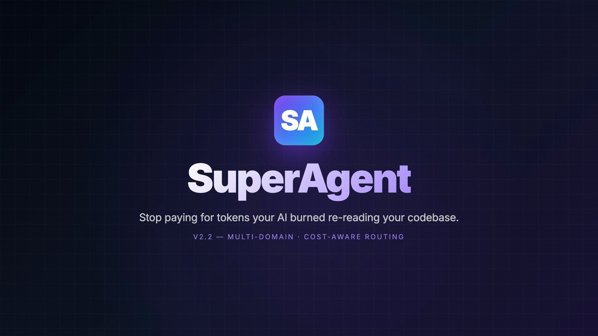
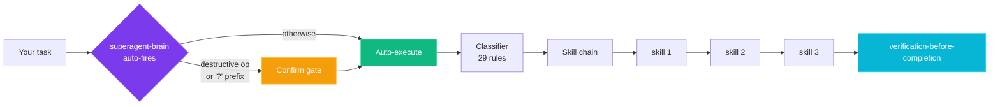

<div align="center">



### Stop paying for tokens your AI burned re-reading your codebase.

**Across 8 AI tools, 6 domains, and any LLM — paid or free. Now with auto-routing on by default.**

<a href="https://github.com/animeshbasak/SuperAgent/raw/main/docs/media/superagent-v2.2-reel.mp4">
  
</a>

<sub>30-second feature reel · rendered deterministically with <a href="https://github.com/heygen-com/hyperframes">hyperframes</a> via <code>/video-craft</code> · <a href="https://github.com/animeshbasak/SuperAgent/raw/main/docs/media/superagent-v2.2-reel.mp4">download MP4 (5.3 MB)</a></sub>

```bash
git clone https://github.com/animeshbasak/SuperAgent
bash SuperAgent/install-universal.sh
```

[](https://github.com/animeshbasak/SuperAgent)
[](#works-with-every-ai-coding-tool-you-use)
[](#the-receipt-share-your-savings)
[](#your-ai-never-runs-out)
[](docs/media/superagent-v2.2-reel.mp4)
[](LICENSE)

</div>

---

## The 60-second test

**Without SuperAgent:**
```
You:    "how does auth work in this repo?"
Agent:  reads 71 files → 187,000 tokens → $2.80 → 4 minutes
```

**With SuperAgent:**
```
You:    "how does auth work in this repo?"
Agent:  graphify query "auth" → 2,600 tokens → $0.04 → 3 seconds
```

**71.5x cheaper. Every query. Forever.**

Multiply that by every "where is X defined", every "why did we do Y", every "walk me through Z". You just got your weekends back.

---

## Your AI never runs out

You hit the Anthropic 5-hour limit at 4pm. You have a deadline at 6pm. **SuperAgent flips you to a free local LLM mid-conversation. Memory preserved. Work uninterrupted.**

```
[SA] ⚠ 82% of weekly Anthropic spend used. 14 hrs to reset.
     Trivial-class tasks auto-route to local. Switch fully?

$ superagent-switch list
Available local models:
  1. ollama/qwen2.5-coder:7b      4 GB  · runs anywhere
  2. ollama/qwen3-coder:next      80B MoE / 3B active · 16 GB laptop
  3. llama-cpp/qwen3.6-27b        16 GB · M3 Max / RTX 4090 · ~Opus quality

$ superagent-switch to 3
[SA] Running 3-step canary (Read → Edit → Bash)... ✓ pass
[SA] Switched. Memory preserved (mempalace + claude-mem + graphify intact).
[SA] Run `superagent-switch back` to restore Anthropic.
```

**What stays the same when you switch:**

| Layer | Continuity |
|---|---|
| Codebase knowledge graph (`graphify`) | injected as prompt text — provider-agnostic |
| Cross-session memory (`mempalace`) | injected as prompt text — provider-agnostic |
| Claude Code observations (`claude-mem`) | injected as prompt text — provider-agnostic |
| Skill chains, routing brain, all 17 skills | run identically on any backend |

**Closest to Opus on local hardware:** Qwen3.6-27B scores 77.2% on SWE-bench Verified (Opus 4.6: 80.8%). That's a 3.7-point gap, on hardware you already own, at $0/month.

---

## How the brain routes



**Default mode is auto-execute.** Type your task, the brain picks skills, runs them. Confirmation gates only fire on destructive ops (`ship`/`push`/`deploy`/`delete`/`drop`), security audits, ambiguous classifier output, or when you opt in with the `? ` prefix:

```bash
/superagent fix the auth bug                # auto-execute
/superagent ? refactor the auth middleware  # show plan, confirm before running
/superagent ship v2.3.0                     # forced confirm (destructive)
```

---

## Multi-domain routing

Same router. Same savings. Every domain.

| Domain | What you say | Skill chain |
|---|---|---|
| **Code** | "fix this bug" / "build feature X" | systematic-debugging → TDD → verification |
| **Design / UI** | "make this premium" / "build a dashboard" | brainstorming → ui-ux-pro-max |
| **Creative web** | "Awwwards-class hero" / "WebGL site" | webgl-craft → writing-plans |
| **Video** | "make a 30s product video" / "render an MP4" | video-craft → hyperframes render |
| **Security** | "audit this" / "OWASP scan" | cso → security-review |

Type your task. The brain routes.

---

## Works with every AI coding tool you use

| | | | |
|---|---|---|---|
| **Claude Code** | **Codex CLI** | **Cursor** | **Windsurf** |
| **GitHub Copilot** | **Gemini / Antigravity** | **Continue.dev** | **Aider** |

One installer. Auto-detects every platform on your machine. Installs the right adapter for each.

```bash
bash install-universal.sh --list      # see what's detected
bash install-universal.sh             # install everywhere
```

**Optional bundles** (opt-in, gated by flags):

```bash
bash install-universal.sh --with-video       # hyperframes + FFmpeg (~150 MB)
bash install-universal.sh --with-free-llm    # Ollama + free-claude-code proxy (~5 GB)
bash install-universal.sh --with-near-opus   # llama.cpp + Qwen3.6-27B (~16 GB) ⚠ confirms first
bash install-universal.sh --full             # everything (~21 GB) ⚠ confirms first
```

---

## Why it exists

Every AI coding session starts cold. You re-explain the same codebase. The agent reads 40 files to answer one question. Forgets what you decided last Tuesday. Dives into code before you've agreed on a plan. Says "done" when it isn't. Hits its limit at 4pm before your 6pm deadline.

SuperAgent fixes all of it with five levers:

| Lever | What it does | The number |
|---|---|---|
| **graphify** | Codebase → queryable knowledge graph | **71.5x** fewer tokens per query |
| **mempalace** | Cross-session memory, local-first | **96.6%** retrieval accuracy, no API keys |
| **Routing brain** | "Fix bug" auto-routes to debug → TDD → verify | **20/20** on routing benchmark |
| **33 battle-tested skills** | core 17 + 16 `agent-skills:*` (spec, plan, incremental, ADR, perf, browser-test, deprecation, …) | **Enforced**, not optional |
| **Cost-aware fallback** | Auto-switch to local LLM when limits approach | **0 rate-limits hit** |

---

## Install in 30 seconds

```bash
git clone https://github.com/animeshbasak/SuperAgent
cd SuperAgent
bash install-universal.sh
```

That's it. Restart your agent. Type `superagent`.

**Platform-specific:**
```bash
bash install-universal.sh --platform codex
bash install-universal.sh --platform cursor
bash install-universal.sh --platform gemini
bash install.sh                                # Claude Code (original)
```

**Requirements:** Python 3 · bash/zsh · macOS or Linux · your AI coding tool of choice

---

## SuperAgent vs everything else

Cursor, Cline, Aider, and Continue.dev are **clients** — they are the IDE shell around the model. GitHub Copilot is a **model** — bound to one provider. SuperAgent is the **router that sits underneath all of them**.

| | SuperAgent | Cursor | Cline | Aider | Copilot |
|---|---|---|---|---|---|
| **Cost-aware routing** | ✓ | — | — | — | — |
| **Multi-tool (works in all clients)** | ✓ | locked to Cursor | locked to VS Code | locked to Aider CLI | locked to GitHub |
| **Multi-domain (code + video + design)** | ✓ | code only | code only | code only | code only |
| **Free LLM fallback (memory preserved)** | ✓ | — | partial (BYO key) | partial (BYO key) | — |
| **Knowledge graph + cross-session memory** | ✓ (graphify + mempalace) | partial | — | — | — |
| **Open source, local-first** | ✓ MIT | proprietary | MIT | Apache 2.0 | proprietary |

We don't compete with your IDE. We make every IDE save more.

---

## The receipt: share your savings

After any session:

```bash
/token-stats
```

```
SuperAgent Token Stats — /your/project
──────────────────────────────────────────────
Compression ratio : 48.3x  (your codebase, measured 2026-04-22)
──────────────────────────────────────────────
Lifetime
  Graphify queries  : 47      → 198k tokens saved
  Mempalace hits    : 23      → ~31k tokens saved
  Total saved       : ~229k tokens  ≈ $3.44 at Sonnet rates
  Free-LLM sessions : 12      → 0 rate-limits hit

Last 5 sessions
  2026-04-22    12 queries     ~58k saved
  2026-04-21     8 queries     ~38k saved
──────────────────────────────────────────────
```

**Want a badge for your own README?**

```bash
/token-stats --badge
```

Outputs pastable markdown:
```markdown
[](https://github.com/animeshbasak/SuperAgent)
[](https://github.com/animeshbasak/SuperAgent)
```

For video-craft, every render auto-stamps a footer: `Rendered by SuperAgent · 4.2 min · $0.83`. Add `/render-stats --badge` to your repo README for shareable render economics.

---

## What you get

### Core tools

| Tool | Purpose |
|---|---|
| `superagent-classify` | Any task → the right skill chain + complexity, as JSON |
| `superagent-compile` | Skills → platform-native instructions (8 formats) |
| `superagent-switch` | Hot-swap LLM backend (list/to/back/canary/status/auto) |
| `superagent-chain` | Run a YAML skill chain |
| `superagent-cost` | Token cost by model, with coach notes |
| `graphify` | Build and query your codebase knowledge graph |
| `mempalace` | Local-first cross-session memory |

### 17 skills, auto-routed

| Skill | When it fires |
|---|---|
| `superagent` | Master router — classifies task, composes chain, picks backend |
| `auto-fallback` | Decides when to switch to local LLM (limits, trivial tasks) |
| `investigate` | "Why did X break?" — reproduce → isolate → explain → verify |
| `review` | "Is this ready to merge?" — 6-point diff gate |
| `ship` | "Ship it" — 20-step pipeline (test → review → commit → push → PR) |
| `cso` | "Audit this" — OWASP Top-10 + STRIDE + secrets scan |
| `plan-ceo-review` | Pressure-test plan scope (4-mode framework) |
| `plan-eng-review` | Lock architecture, edge cases, test coverage |
| `plan-design-review` | Rate 10 design dimensions 0–10, fix any <7 |
| `autoplan` | Pipeline plan through CEO → design → eng review |
| `office-hours` | YC-style product intake (6 forcing questions) |
| `webgl-craft` | Premium WebGL/3D — Awwwards-class technique library |
| `video-craft` | HTML → MP4 via hyperframes (deterministic, frame-accurate) |
| `free-llm` | Set up free-claude-code proxy + provider routing |
| `learn` | Per-project learnings that stick across sessions |
| `bench` | 20-prompt classifier benchmark (HARD GATE ≥ 0.90) |
| `fanout` | Parallel skill execution |
| `token-stats` | Your savings receipt (+ shareable badge) |

No skill memorization. Type your task. It routes.

---

## Make videos with hyperframes

Author HTML compositions. Render frame-accurate MP4s. Same router, same savings.

```bash
/video-craft "30-second product ad for X"
```

```
[SA] Routing → video-craft skill
[SA] Loading recipe: product-ad-30s
[SA] Composition authored: my-ad.html
[SA] Preview at http://localhost:3000/preview ... press enter to render
[SA] Rendering 30s @ 30fps... done in 4 min 12 sec
[SA] Output: my-ad.mp4 (28 MB, 30 fps, 1920x1080)
[SA] Footer: "Rendered by SuperAgent · 4.2 min · $0.83"
```

5 technique domains, 4 production recipes (hello-world, product-ad-30s, data-driven-chart, lower-third-overlay). Distilled from the open-source [hyperframes](https://github.com/heygen-com/hyperframes) framework.

**The reel at the top of this README** was authored and rendered through the same pipeline. Source composition: [`docs/video/reel/index.html`](docs/video/reel/index.html). Output: [`docs/media/superagent-v2.2-reel.mp4`](docs/media/superagent-v2.2-reel.mp4) — 1920×1080, 30 fps, 30 s, 5.3 MB.

---

## Proof

```bash
bash bench/run.sh
# PROMPTS 20   PASS 20   FAIL 0   AVG 1.000
# HARD GATE: PASS  (avg >= 0.90, fails <= 2)

bash test/test-classify.sh
# Tests: 18   PASS: 18   FAIL: 0

bash test/test-canary.sh
# Tests: 4    PASS: 4    FAIL: 0
```

Claude Code surface is MD5-pinned on every release. Multi-platform support is additive only — your existing setup never changes.

---

## FAQ

**Is it free?** Yes. Open source. Local-first. No API key. Default mode never sends code to third parties.

**Will my code leak to free LLM providers?** No — by default. Free-LLM mode is **local-only**: Ollama or llama.cpp on your machine. Cloud free-tier providers (NIM, OpenRouter, DeepSeek) are explicit opt-in via `--cloud` flag.

**How does context preservation work across model switches?** mempalace, claude-mem, and graphify all inject text into prompts — they're provider-agnostic. When you switch the underlying LLM, the same memory text lands in the same prompts. Different brain, same memory. Your AI walks into the new model already knowing your project.

**Is local LLM quality really good enough?** For trivial tasks (lint, format, rename, simple regex): yes — qwen2.5-coder:7b runs on a laptop. For moderate tasks (single feature): qwen3-coder:next gets close to Sonnet. For complex agentic work: nothing local matches Opus 4.7. SuperAgent's `complexity` classifier won't suggest local for tasks it would fail.

**Will I have to change my workflow?** No. Just install. Routing is automatic.

**Does it work with my existing Claude setup?** Additive only. Zero modification to existing files — verified by MD5 on every release (`install.sh: bbb1ebc22cecf60106e33a25b001f130`).

**I'm on Cursor, not Claude Code. Does it work?** Yes. The compiler turns 17 skills into Cursor `.mdc` rules, Codex `AGENTS.md`, Copilot instructions, Continue rules, etc. — whatever your platform expects. Free-LLM auto-fallback currently works on Claude Code only; other platforms can run `superagent-switch` manually.

**What happens if my local model crashes mid-task?** Canary preflight (3-step Read → Edit → Bash test) refuses to switch if the model fails. Once switched, the auto-fallback policy on canary failure is "freeze + prompt" — you decide whether to retry, pick a different model, or restore Anthropic.

**Cursor has a 12k char rule limit. How?** Compiler auto-compacts. Your Cursor rules stay at ~4.7k chars. Measured on every build.

**Can I add my own skills?** Yes. Drop a `SKILL.md` into `skills/<name>/`. Run `superagent-compile --platform all`. Every platform picks it up.

**What if I break something?** `install.sh` is MD5-pinned. `test/test-classify.sh` is a hard gate. `bench/run.sh` enforces ≥0.90 routing accuracy. Regressions can't land.

---

## Platform formats

The compiler (`bin/superagent-compile`) is the source of truth. Each platform gets the format it expects:

| Platform | Format | Location | Size |
|---|---|---|---|
| Claude Code | `CLAUDE.md` + plugins + skills | `~/.claude/` | Full plugin system |
| Codex CLI | `AGENTS.md` | `~/.codex/AGENTS.md` | ~67k chars |
| Cursor | `.mdc` rules | `.cursor/rules/*.mdc` | 4.7k / 12k limit |
| Windsurf | `AGENTS.md` + rules | `.windsurf/rules/` | Full + modular |
| GitHub Copilot | `copilot-instructions.md` | `.github/` | ~10k chars |
| Gemini / Antigravity | `GEMINI.md` + `SKILL.md` | `~/.gemini/` + `.agent/rules/` | Per-skill files |
| Continue.dev | Numbered rules | `.continue/rules/` | 17 files |
| Aider | `CONVENTIONS.md` | project root + `.aider.conf.yml` | Auto-loaded |

Recompile any time:
```bash
python3 bin/superagent-compile --platform all
```

---

## Routing table

| You say | It routes to |
|---|---|
| "build X" / "add feature Y" | brainstorming → writing-plans → TDD → executing-plans → verification |
| "fix bug" / "broken" / "error" | systematic-debugging → TDD → verification |
| "understand codebase" | graphify query → smart-explore |
| "ship" / "PR" / "merge" | review → ship |
| "design" / "UI" / "component" | brainstorming → ui-ux-pro-max |
| "3D" / "WebGL" / "cinematic" | webgl-craft → writing-plans |
| "make a video" / "render MP4" | video-craft |
| "use local LLM" / "switch to free" | free-llm → superagent-switch |
| "security" / "audit" | cso → security-review |
| "why did X happen" | investigate → mem-search |
| "plan" / "roadmap" | brainstorming → writing-plans → plan-ceo-review → plan-eng-review |
| 2+ independent tasks | dispatching-parallel-agents |
| "PRD" / "spec" / "what to build" | `agent-skills:spec-driven-development` |
| "ideate" / "stress-test the idea" | `agent-skills:idea-refine` |
| "task breakdown" / "decompose" | `agent-skills:planning-and-task-breakdown` |
| "API design" / "contract-first" | `agent-skills:api-and-interface-design` |
| "deprecate" / "sunset" / "migration path" | `agent-skills:deprecation-and-migration` |
| "ADR" / "architecture decision" | `agent-skills:documentation-and-adrs` |
| "Core Web Vitals" / "perf audit" | `agent-skills:performance-optimization` |
| "browser test" / "Chrome DevTools" | `agent-skills:browser-testing-with-devtools` |
| "CI pipeline" / "GitHub Actions" | `agent-skills:ci-cd-and-automation` |

---

## Project structure

```
SuperAgent/
├── skills/                  17 skills (source of truth)
├── bin/                     CLIs (classify, compile, switch, chain, cost, learn)
├── hooks/                   Bash hooks (tracker, statusline, distill, limit-watch)
├── agents/                  Claude agent files
├── adapters/                Platform adapters (codex, gemini, cursor, windsurf,
│                            copilot, continue, aider) — instruction templates
├── bundles/                 Optional dependency installers (hyperframes,
│                            free-claude-code, local-llms) — opt-in via flags
├── bench/                   20-prompt classifier benchmark
├── test/                    Test suite (canary fixtures, switch tests)
├── install.sh               Claude Code installer
└── install-universal.sh     Multi-platform installer + bundle flags
```

---

## Index your project (optional but recommended)

```bash
cd ~/my-project
graphify update ./src                         # build knowledge graph
mempalace init . --yes && mempalace mine .    # index for memory
```

Then in your agent:
```
graphify query "how does authentication work?"
mempalace search "auth decisions from last week"
```

---

## Links

- [graphify](https://github.com/animeshbasak/graphifyy) — knowledge graph engine
- [mempalace](https://github.com/animeshbasak/mempalace) — local AI memory
- [hyperframes](https://github.com/heygen-com/hyperframes) — HTML-to-MP4 framework
- [free-claude-code](https://github.com/Alishahryar1/free-claude-code) — Anthropic-compatible proxy for free LLMs
- [superpowers](https://github.com/claude-plugins-official/superpowers) — 20+ workflow skills
- [claude-mem](https://github.com/thedotmack/claude-mem) — cross-session observations
- [ui-ux-pro-max](https://github.com/nextlevelbuilder/ui-ux-pro-max-skill) — frontend design intelligence

---

## Changelog

See [CHANGELOG.md](CHANGELOG.md). Latest: **v2.2.0 — Multi-Domain + Cost-Aware Routing**.

---

<div align="center">

### If this saved you tokens, the least you can do is star it.

**[Star on GitHub](https://github.com/animeshbasak/SuperAgent)** · **[Tweet your `/token-stats` receipt](https://twitter.com/intent/tweet?text=SuperAgent%20just%20saved%20me%20200k%20tokens%20%2B%20zero%20rate-limits%20on%20my%20last%20AI%20coding%20session.%20Works%20with%20Claude%2C%20Cursor%2C%20Copilot%2C%20and%205%20more.%20https%3A%2F%2Fgithub.com%2Fanimeshbasak%2FSuperAgent)** · **[Share on HN](https://news.ycombinator.com/submitlink?u=https%3A%2F%2Fgithub.com%2Fanimeshbasak%2FSuperAgent)**

Built by devs who got tired of watching their AI burn tokens on re-reads — and run out of them at 4pm.

</div>
